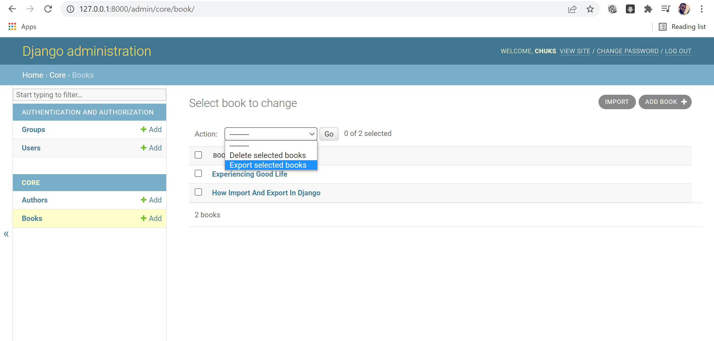
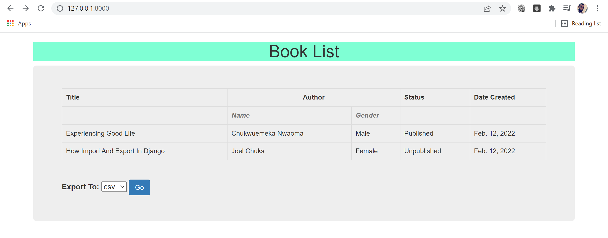
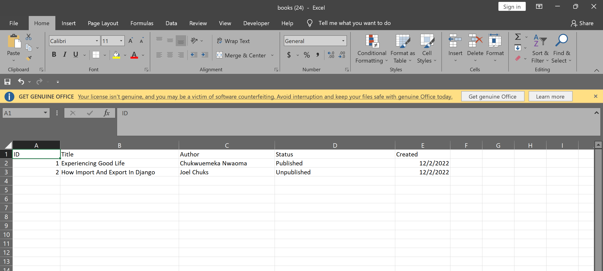
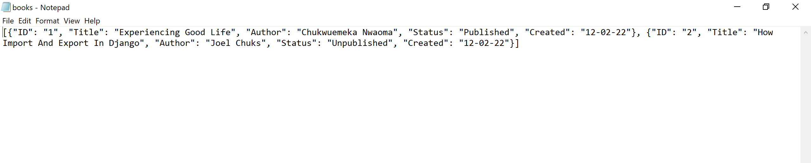
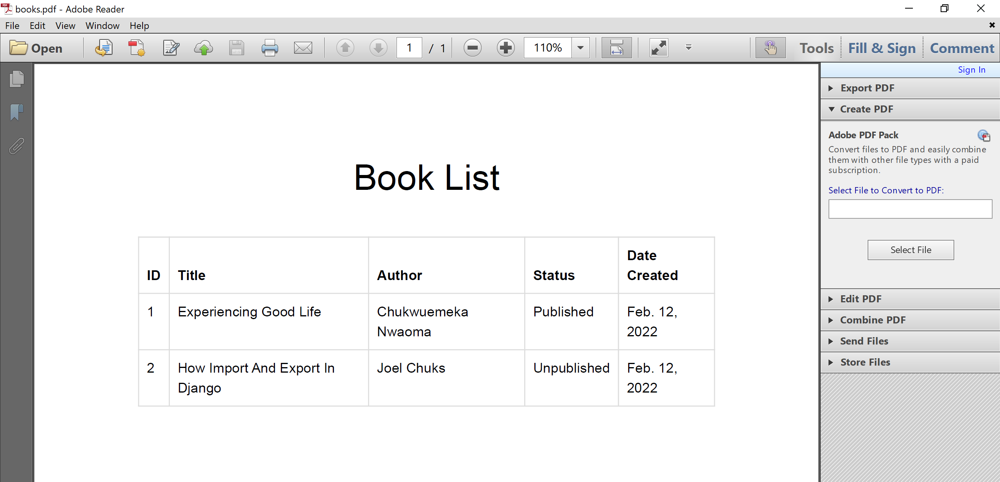

# Django Import and Export
A Django project incorporating PDF export with other formats delivered by django-import-export package.

As the name suggests, this project covers a basic import and export in Django using the django-import-export package.

I have tried to implement a common feature of importing and exporting data to and from the model via the admin panel while also digging deeper into bringing the export feature to the views and passing it straight to the template.

While the django-import-export package does not cover exporting to PDF, I have implemented that a PDF export together with a few others like CSV, XLS and JSON and made them downloadable in one selection and click.

Let's get started with the codes!

First, set up a Django project with a basic model. In my case, I have made it a bit tougher by creating two related models.

Visit https://django-import-export.readthedocs.io/en/latest/api_widgets.html to install django-import-export, then set up the admin import-export mixins.
Introduce a dehydrate_[field] function for fields with foreign keys and instantiate them in the resources class.

class BookResource(resources.ModelResource):
    author = Field()
    created = Field()
    
    class Meta:
        model = Book
        fields = ('id', 'title', 'author', 'publish_status', 'created')
        export_order = ('id', 'title', 'author', 'publish_status', 'created')

    def dehydrate_author(self, obj):
        return obj.author.name
        
    def dehydrate_created(self, obj):
        return obj.created.strftime("%d-%m-%y")
        

class BookAdmin(ImportExportActionModelAdmin):
    resource_class = BookResource

admin.site.register(Author)
admin.site.register(Book, BookAdmin)

When that is done, you'll notice the import and export buttons on the admin dashboard, and that is all.

However, to bring this feature from the views to the template, start off with creating a resources.py file, importing the models, as well as the resources and fields from import_export.

Write a resources class just like with the admin.py file and write its meta class too.
Move to the views and use a created form to collect predefined responses, then match each response to a format and return.

# If User Selects CSV Format
            if dataFormat == 'csv':
                book_resource = BookResource()
                dataset = book_resource.export()
                response = HttpResponse(dataset.csv, content_type='text/csv')
                response['Content-Disposition'] = 'attachment; filename="books.csv"'
                return response

For the PDF format, import weasyprint and also install GTK3-Runtime if on a windows machine, and don't forget to add to path.

 # If User Selects PDF Format   
            elif dataFormat == 'pdf':
                # obj = Book.objects.all()
                template = get_template('core/pdf-output.html')
                html = template.render(context)
                response = HttpResponse(content_type='application/pdf')
                result = HTML(string=html).write_pdf(response)
                response['Content-Disposition'] = 'attachment; filename="books.pdf"'
                response['Content-Transfer-Encoding'] = 'binary'
                return response

Create an output template, pass the template name to the views, then write pdf, and that's all. Too Easy.  

Check out https://doc.courtbouillon.org/weasyprint/latest/first_steps.html for more details on weasyprint.
Check out the complete code repo on https://github.com/joelchooks/import_export

